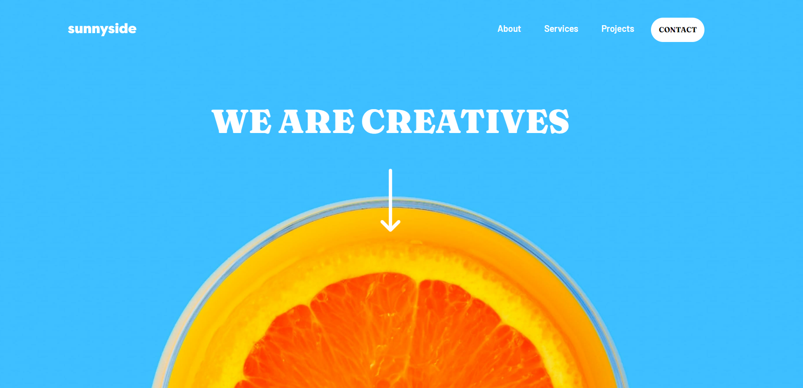

# Frontend Mentor - Sunnyside agency landing page 

This is a solution to the [Sunnyside agency landing page challenge on Frontend Mentor](https://www.frontendmentor.io/challenges/sunnyside-agency-landing-page-7yVs3B6ef). Frontend Mentor challenges help you improve your coding skills by building realistic projects.

## Table of contents

- [Overview](#overview)
  - [The challenge](#the-challenge)
  - [Screenshot](#screenshot)
  - [Links](#links)
  - [Built with](#built-with)
  - [Continued development](#continued-development)
  - [Useful resources](#useful-resources)
- [Author](#author)

## Overview

### The challenge

Users should be able to:

- View the optimal layout for the site depending on their device's screen size
- See hover states for all interactive elements on the page

### Screenshot

### Links

- Solution URL: [(https://github.com/Luzanne-S/Sunnyside-Agency-LandingPage]
- Live Site URL: [https://luzanne-s.github.io/Sunnyside-Agency-LandingPage/]

### Built with

- Semantic HTML5 markup
- CSS custom properties
- Flexbox
- CSS Grid

### Continued development

I plan on making my new sites responsive to all types of devices

### Useful resources

- [Glassmorphism](https://hype4.academy/tools/glassmorphism-generator) - This site is useful when trying to create the glassmorphism effect
- [css3 shapes](https://www.cssportal.com/css3-shapes/) - This site helped me create the sharp point on my mobile menu

## Author

- Frontend Mentor - [@Luzanne-S](https://www.frontendmentor.io/profile/Luzanne-S

